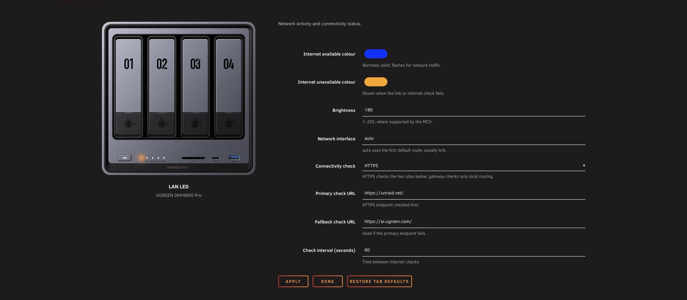
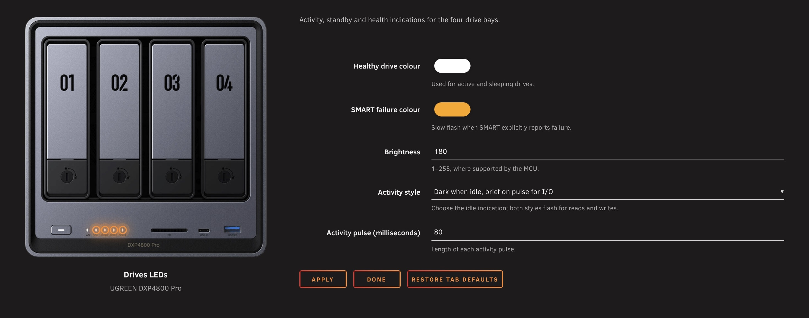
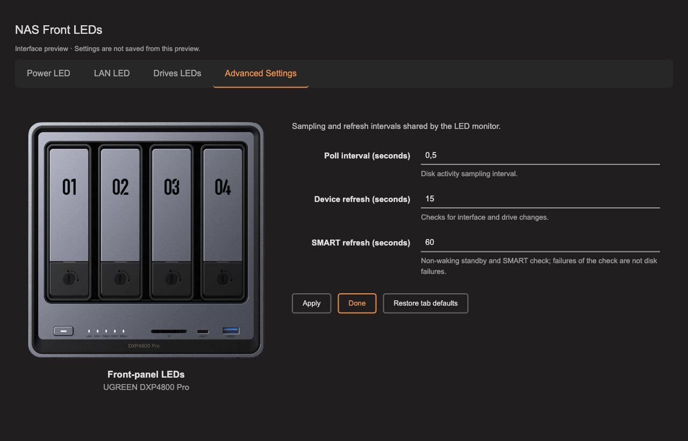
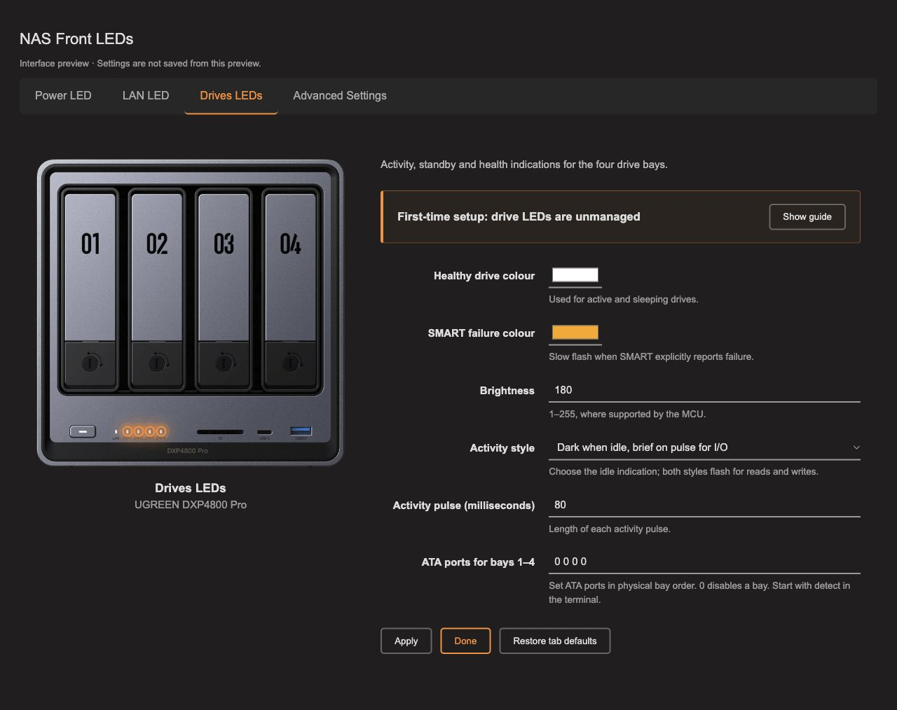

<div align="center">


<h1>UGREEN DXP4800 Pro LEDs</h1>

<p><strong>Front-panel LED control for the UGREEN DXP4800 Pro running <a href="https://unraid.net/">Unraid</a>.</strong></p>

<p>
  <a href="https://github.com/EllipticSet/UGREEN-DXP4800Pro-LEDs/actions/workflows/validate.yml"></a>
  <a href="https://github.com/EllipticSet/UGREEN-DXP4800Pro-LEDs/releases/latest"></a>
  
  <a href="https://github.com/EllipticSet/UGREEN-DXP4800Pro-LEDs/releases"></a>
  <a href="LICENSE"></a>
</p>

</div>

This plugin controls the Power, LAN and four drive-bay LEDs, with configurable colours, brightness, disk activity pulses and standby breathing. Settings are managed directly in the Unraid WebGUI.

> This is an independent project, not an official release from UGREEN, ich777 or flybrys.

## Versioning

Releases use `MAJOR.MINOR.PATCH`: patches for fixes, minor versions for compatible features, major versions for breaking changes.

## Settings screenshots

| Power LED | LAN LED |
| --- | --- |
| <a href="docs/screenshots/NAS-Front-LEDs-power.jpg"></a> | <a href="docs/screenshots/NAS-Front-LEDs-lan.jpg"></a> |

| Drives LEDs | Advanced Settings |
| --- | --- |
| <a href="docs/screenshots/NAS-Front-LEDs-drives.jpg"></a> | <a href="docs/screenshots/NAS-Front-LEDs-advanced.jpg"></a> |

<details>
<summary>Collapsed setup guide</summary>

<a href="docs/screenshots/NAS-Front-LEDs-drives-collapsed.jpg"></a>

</details>

<details>
<summary>Mobile preview</summary>

<a href="docs/screenshots/NAS-Front-LEDs-mobile.gif"></a>

</details>

## Compatibility

| Requirement | Supported configuration |
| --- | --- |
| NAS | UGREEN DXP4800 Pro |
| Unraid | 7.3+ |
| Kernel | `6.18.38-Unraid` |

The installer checks the exact DMI model and kernel before loading the bundled LED module. Unraid 7.3 or later is accepted only when that exact kernel is present. Hardware testing was performed on Unraid 7.3.2; other Unraid versions remain untested. Other models and kernels are not supported by this build.

The plugin uses Intel SMBus I801 and the `led-ugreen` module with `write_protocol=legacy`. No GT DesignWare modules are installed.

## Features

- Native Unraid tabs: **Power LED**, **LAN LED**, **Drives LEDs**, and **Advanced Settings**.
- Front-panel photo with the selected LEDs highlighted, alongside colour, brightness and behaviour controls.
- Apply and restore defaults independently for each tab.
- Power status and shutdown blinking.
- LAN activity indication with configurable connectivity checks.
- Drive activity pulses, standby breathing and warning indications.
- Configurable physical bay mapping and monitoring intervals.
- Non-waking SMART checks, scheduled separately from disk activity sampling.
- Persistent settings, validated configuration and atomic saves.
- Existing configuration retained during updates, with runtime rollback attempted if the new monitor fails to start.
- Bundled dependencies and checksums, with no separate package downloads during installation.

## Installation

1. Remove any competing LED plugin or controller. If its module or I2C client remains loaded, reboot before installing this plugin. **ITE IT87 Driver and FanCtrl Plus do not need to be removed.**
2. Open **Plugins → Install Plugin** in Unraid.
3. Paste the following URL and install:

   ```text
   https://raw.githubusercontent.com/EllipticSet/UGREEN-DXP4800Pro-LEDs/main/UGREEN-DXP4800Pro-LEDs.plg
   ```

4. Open **Settings → NAS Front LEDs** to configure the plugin.

Plugin updates preserve existing settings at:

```text
/boot/config/plugins/UGREEN-DXP4800Pro-LEDs/settings.cfg
```

The public plugin name is **UGREEN DXP4800 Pro LEDs**; its Unraid Settings page is named **NAS Front LEDs**. The existing repository URL, `.plg` filename and internal plugin/configuration directories are retained so existing installations can update directly.

The Community Applications submission has been approved. As of October 4, 2026, the plugin is not yet available in the catalogue. Use the installation URL above in the meantime. See [Community Applications maintenance](docs/community-apps.md).

<details>
<summary>Manual installation from the terminal</summary>

Copy `UGREEN-DXP4800Pro-LEDs.plg` to `/tmp` on the NAS, then run:

```bash
plugin install /tmp/UGREEN-DXP4800Pro-LEDs.plg
```

Use an absolute path: Unraid's PHP startup can change the working directory.

</details>

## Configuration

Open **Settings → NAS Front LEDs**. Choose a tab from the menu at the top; the front-panel image on the left highlights the relevant LEDs, and the settings appear on the right. **Apply** saves only the current tab; **Restore tab defaults** also affects only that tab. On narrow screens the image appears above the controls.

Use the Settings page to select colours, brightness, the network interface, connectivity checks, drive activity style and monitoring intervals.

### Drive-bay mapping

Drive LEDs are **unmanaged by default**: the initial ATA port mapping is `0 0 0 0`.

1. Run the detection command on the NAS:

   ```bash
   /usr/local/sbin/ugreen-pro-leds detect
   ```

2. Confirm which ATA port corresponds to each physical bay, in bay order. ATA numbering alone does not establish physical bay order.
3. Enter the confirmed mapping in the Settings page and apply it.
4. Verify one drive at a time by reading existing data and observing its LED.

Mapping `1 2 3 4` was verified on the test NAS. Check your own machine before using it. Leave a bay set to `0` to keep it unmanaged.

### Network connectivity

Automatic interface selection follows the default route, typically `br0`. You can select a different interface manually.

| Mode | What is checked |
| --- | --- |
| HTTPS (default) | Link status and reachability of configured HTTPS endpoints |
| Gateway | Link status and local routing |
| None | Link status only |

HTTPS checks approximate Internet availability. An endpoint outage, DNS filtering or firewall rule can produce an orange LAN LED even when other sites remain accessible. Background traffic also triggers LAN blinking.

## LED behaviour

The following indications use the default white and orange colours. Colours and brightness values can be changed in Settings. The physical brightness response depends on the LED controller; some controllers may treat nonzero values as full brightness.

| LED | Indication | Meaning |
| --- | --- | --- |
| Power | Solid white | Power colour set when the monitor starts; may remain on after monitoring stops |
| Power | White blink, 500 ms on / 500 ms off | Unraid shutdown hook running |
| LAN | White, blinking with traffic | Link present and connectivity check passing |
| LAN | Orange, blinking with local traffic | Link present but HTTPS checks failing |
| LAN | Solid orange | Interface or link unavailable |
| Drive | Off when idle, white pulses during I/O | Active drive |
| Drive | White breathing | SMART reports standby |
| Drive | Slow orange blink | Explicit SMART failure or disappearance of a previously present drive |
| Drive | Off | Initially empty mapped bay |
| Drive | Left unmanaged | Bay mapping set to `0` |

A solid-while-idle drive style with brief off pulses is also available. Dark idle is this plugin's default; the UGREEN LED guide does not specify an active-but-idle indication.

Disk activity is sampled every **0.5 seconds** by default and reflects aggregated activity rather than every individual request. SMART checks use `-n standby,0` to avoid waking sleeping drives. A failed SMART query is not treated as a confirmed disk failure. Intentional removal of a drive can trigger the same warning as unexpected disappearance.

The plugin does not infer general system faults or whole-system sleep. Stopping the Unraid array does not establish that the NAS is asleep. LED indications supplement Unraid diagnostics and notifications.

## Diagnostics

Check the monitor and recent log entries:

```bash
/usr/local/sbin/ugreen-pro-leds status
tail -n 60 /var/log/ugreen-pro-leds.log
```

Stop LED monitoring:

```bash
/usr/local/sbin/ugreen-pro-leds stop
```

Stopping releases managed triggers and turns off configured drive LEDs. The Power LED remains on; use `status` to check whether the monitor is running. It does not shut down the NAS. Logs are stored in RAM; settings are stored persistently on the boot device.

For problems or suggestions, open a [GitHub issue](https://github.com/EllipticSet/UGREEN-DXP4800Pro-LEDs/issues). Include your Unraid version, kernel, plugin version, the observed behaviour and relevant status/log output. Remove any private information before posting.

## Removal

Remove the plugin from **Plugins** in Unraid. Saved settings and shared `i2c-tools` remain installed.

The installer adds an identified shutdown-hook line to `/boot/config/stop`; removal deletes that line while preserving unrelated changes. If removal is incomplete or an old LED module remains loaded, reboot before installing another LED controller.

## Validation status

Hardware testing of earlier development builds on a DXP4800 Pro with Unraid 7.3.2 and the supported kernel confirmed:

- Installation and monitor startup.
- Solid white Power and white LAN activity on `br0`.
- Saving settings and restarting the monitor through Apply.
- Correct four-bay mapping, disk read pulses and standby breathing.
- Settings retained during a development-build update.
- Automatic startup after reboot and after a full shutdown followed by power-on.
- Power blinking during shutdown and returning to solid white after startup.

See [Validation](docs/validation.md) for automated checks, historical hardware results and remaining verification work. These earlier hardware results do not establish a complete hardware test of the current release.

## License and acknowledgements

The monitor, WebGUI and packaging adaptations are licensed under the [MIT License](LICENSE). Bundled third-party components retain their own licences, including GPL-2.0-only for the LED kernel module and component-specific GPL/LGPL terms for `i2c-tools`. See [THIRD_PARTY.md](THIRD_PARTY.md) for details.

This project builds on:

- [flybrys/UGREEN-DXP4800GT-LED-Driver](https://github.com/flybrys/UGREEN-DXP4800GT-LED-Driver), commit `32c06cfd4a4d0fa27f5610f678391ed2c57edfd0`: adapted monitor and settings, and the prebuilt LED module.
- [ich777/unraid-ugreenleds-driver](https://github.com/ich777/unraid-ugreenleds-driver), commit `3497eb5367dfdd8ab494eb481e16111216ba9f48`: Intel I801 setup, ATA mapping and packaging references.
- [miskcoo/ugreen_leds_controller](https://github.com/miskcoo/ugreen_leds_controller/tree/c830a2293cf5c67c58e5a98ca339b089b2b13fc3), commit `c830a2293cf5c67c58e5a98ca339b089b2b13fc3`: corresponding GPL-2.0-only module source, included with its hardening patch.
- [UGREEN's LED indicator guide](https://ai.ugreen.com/blogs/knowledge/ugreen-nas-led-indicators-meaning): reference for activity, standby, shutdown and white/orange indications.

The original driver's [DXP4800 Pro report](https://github.com/miskcoo/ugreen_leds_controller/issues/121) concerns Proxmox and is not a test of this Unraid plugin.

<details>
<summary>Build and bundled dependency provenance</summary>

Sources, original licence notices, the module patch and `BUILD_INFO` are included in [`vendor/`](vendor/).

`i2c-tools` 4.3 is redistributed from ich777 with SHA-256 `9730e890d81743f4827715ae38019715fe8252c9bc6d95af4b5f64339238106c`. Its official source archive is included; see the archive's COPYING and LICENSE files for component-specific terms.

[`build/package.py`](build/package.py) regenerates the offline package without changing the host. Rebuilding the kernel module requires Linux x86_64, the exact Unraid kernel source and the tools described in [`build/build-module.sh`](build/build-module.sh).

</details>
