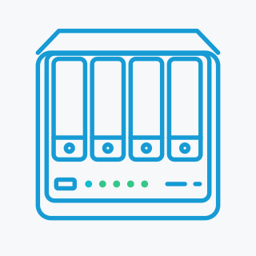
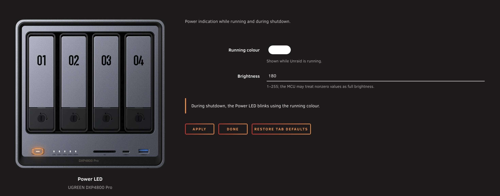
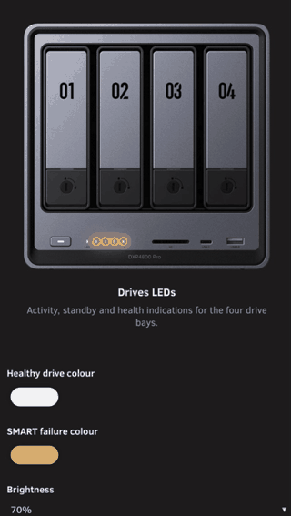

<div align="center">



<h1>UGREEN DXP4800 Pro LEDs</h1>

<p><strong>Front-panel LED control for the UGREEN DXP4800 Pro running <a href="https://unraid.net/">Unraid</a>.</strong></p>

<p>
  <a href="https://github.com/EllipticSet/UGREEN-DXP4800Pro-LEDs/actions/workflows/validate.yml"></a>
  <a href="https://github.com/EllipticSet/UGREEN-DXP4800Pro-LEDs/releases/latest"></a>
  
  <a href="https://github.com/EllipticSet/UGREEN-DXP4800Pro-LEDs/releases"></a>
  <a href="LICENSE"></a>
</p>

</div>

This plugin controls the Power, LAN and four drive-bay LEDs on the UGREEN DXP4800 Pro running Unraid. Colours, brightness, disk activity pulses and standby breathing can be configured directly in the Unraid WebGUI.

> This is an independent project, not an official release from UGREEN, ich777 or flybrys.

## Versioning

I use `MAJOR.MINOR.PATCH` for releases: patch versions contain fixes, minor versions add backward-compatible features, and major versions introduce breaking changes.

## Settings preview

<a href="docs/screenshots/NAS-Front-LEDs-power.jpg"></a>

<details>
<summary>Mobile preview — Drives LEDs (1.2.0)</summary>

<a href="docs/screenshots/NAS-Front-LEDs-mobile.gif"></a>

</details>

## Compatibility

| Requirement | Supported configuration |
| --- | --- |
| NAS | UGREEN DXP4800 Pro |
| Unraid | 7.3.2+ |
| Kernel | `6.18.38-Unraid` (Unraid 7.3.2) or `6.18.54-Unraid` (Unraid 7.3.3) |

The installer checks the NAS model through DMI and requires an exact match between the running kernel and a bundled LED module. Unraid 7.3.2 or later is required, but the only supported kernels are those listed above. Both modules are included; the installer selects the correct one automatically, including after an Unraid upgrade or rollback.

I tested 1.3.0 on my NAS with Unraid 7.3.2, then verified 1.3.1 on Unraid 7.3.3. The results and remaining checks are recorded in [Validation](docs/validation.md).

> [!WARNING]
> **Other models and kernels are not supported by this build.**

The plugin uses Intel SMBus I801 and the `led-ugreen` module with `write_protocol=legacy`. No GT DesignWare modules are installed.

## Features

- Four native Unraid tabs: **Power LED**, **LAN LED**, **Drives LEDs**, and **Advanced Settings**. Each tab has its own Apply and restore-defaults controls, with help available by clicking a setting name.
- A front-panel photo that highlights the LEDs controlled by the selected tab.
- Adjustable colours and brightness, shown as percentages in 10% steps or as raw controller values. The default brightness is 70%.
- Power indication and blinking during shutdown; LAN activity with configurable connectivity checks; drive activity pulses, standby breathing and warning indications.
- Adjustable drive-bay mapping and monitoring intervals. SMART checks run separately from activity sampling and do not wake sleeping drives.
- Persistent settings, input validation and atomic saves. Updates preserve settings, except for migration of older default bay mappings, and attempt rollback if the new monitor fails to start.
- Bundled dependencies and checksums, so installation needs no separate dependency downloads.

## Installation

1. Uninstall other LED-control plugins and stop any LED-control services. Then reboot.
2. Open **Apps** in Unraid and search for **UGREEN DXP4800 Pro LEDs**.
3. Select **Install**.
4. Open **Settings → LED Settings** to configure the plugin.

### Direct installation

Alternatively, open **Plugins → Install Plugin** and paste:

   ```text
   https://raw.githubusercontent.com/EllipticSet/UGREEN-DXP4800Pro-LEDs/main/UGREEN-DXP4800Pro-LEDs.plg
   ```

After installation, open **Settings → LED Settings**.

The plugin saves settings on the Unraid boot device at:

```text
/boot/config/plugins/UGREEN-DXP4800Pro-LEDs/settings.cfg
```

The plugin appears as **UGREEN DXP4800 Pro LEDs** in Plugins and as **LED Settings** in Settings. I have kept the existing repository URL, `.plg` filename and internal directories so earlier installations can update directly.

The plugin is available in **Community Applications** as of October 7, 2026. See [Community Applications maintenance](docs/community-apps.md) for catalogue and metadata details.

<details>
<summary>Manual installation from the terminal</summary>

Copy `UGREEN-DXP4800Pro-LEDs.plg` to `/tmp` on the NAS, then run:

```bash
plugin install /tmp/UGREEN-DXP4800Pro-LEDs.plg
```

Use an absolute path: Unraid's PHP startup can change the working directory.

</details>

## Configuration

Open **Settings → LED Settings**, or visit `/Settings/LED-Settings`, and select a tab. Use the Power, LAN and Drives tabs to set colours, brightness, the network interface and drive activity style. Click a setting name to read its help text.

These three tabs show the NAS front panel with the relevant LEDs highlighted. On narrow screens, the image sits above the controls. **Advanced Settings** has no NAS image; it groups the brightness display mode, connectivity checks, drive mapping and monitoring intervals. The optional mapping guide starts closed each time you visit this tab. Use **Show guide / Hide guide** to open or close it.

**Apply** saves only the selected tab. **Restore tab defaults** resets only that tab. The installed version appears on the right of the tab bar and links to its GitHub release notes.

Each LED group defaults to 70% brightness. Percentage mode ranges from 0% (off) to 100% in 10% steps; raw mode accepts values from 0 to 255. Both modes save controller values.

Percentage mode rounds existing values to the nearest ten percent, rounding halfway values upward: for example, a raw value of 180 becomes 70%. Raw mode preserves the exact value. Restoring tab defaults returns brightness to 70%.

### Drive-bay mapping

The default mapping is `1 2 3 4`: ATA ports 1–4 in physical bay order. It stays the same whether one drive or all four are installed. Initially empty bays remain off, and the monitor checks the mapped ports every 15 seconds by default to detect added drives. No manual detection is needed during installation.

Updates replace older automatically generated mappings such as `1 2 0 0` with `1 2 3 4`, so drives added later can be detected. Manually reordered ATA ports are preserved. If your setup needs a different mapping, change it in **Advanced Settings**.

The guide in **Advanced Settings** explains how to use `/usr/local/sbin/ugreen-pro-leds detect` to list ATA ports and devices. To verify a custom mapping, read existing data from one drive at a time and check which LED responds.

### Network connectivity

Automatic interface selection follows the default route, typically `br0`. You can select a different interface manually.

| Mode | What is checked |
| --- | --- |
| HTTPS (default) | Link status and reachability of configured HTTPS endpoints |
| Gateway | Link status and a ping to the default gateway |
| None | Link status only |

HTTPS checks provide an indication of Internet availability. If a configured endpoint is unavailable, or DNS filtering or a firewall blocks the request, the LAN LED can turn orange even while other sites remain accessible.

LAN blinking follows traffic on the selected interface. Background and local traffic also trigger it, including when the connectivity check fails.

## LED behaviour

The table below describes the default white and orange indications. You can change colours and brightness in Settings. The visible brightness depends on the controller; some controllers may treat any nonzero value as full brightness.

| LED | Indication | Meaning |
| --- | --- | --- |
| Power | Solid white | Power colour set when the monitor starts; may remain on after monitoring stops |
| Power | White blink, 500 ms on / 500 ms off | Unraid shutdown hook running |
| LAN | White, blinking with traffic | Link present and connectivity check passing |
| LAN | Orange, blinking with traffic | Link present but the selected connectivity check is failing |
| LAN | Solid orange | Interface or link unavailable |
| Drive | Off when idle, white pulses during I/O | Active drive |
| Drive | White breathing | SMART reports standby |
| Drive | Slow orange blink | Explicit SMART failure or disappearance of a previously present drive |
| Drive | Off | Initially empty mapped bay |
| Drive | Off | Bay mapping set to `0` (disabled) |

The default drive activity style is **Dark when idle**, with brief white pulses during I/O. **Solid when idle**, with brief off pulses during I/O, is also available.

When the set of sleeping drives changes, the monitor restarts their breathing cycles together. The controller receives consecutive start commands, so I still need to verify how closely the LEDs remain aligned on the hardware.

The monitor samples disk activity every **0.5 seconds** by default. LED pulses represent the activity collected during that interval. SMART checks use `-n standby,0` to avoid waking sleeping drives, and a failed query alone does not trigger a confirmed disk-failure indication. Removing a drive intentionally can produce the same warning as an unexpected disappearance.

The LEDs report the states described above; they do not detect general system faults or whole-system sleep. Stopping the Unraid array does not mean the NAS is asleep. Use Unraid diagnostics and notifications to investigate problems.

## Diagnostics

Check the monitor and recent log entries:

```bash
/usr/local/sbin/ugreen-pro-leds status
tail -n 60 /var/log/ugreen-pro-leds.log
```

Stop LED monitoring:

```bash
/usr/local/sbin/ugreen-pro-leds stop
```

The stop command releases the LED triggers and turns off the configured drive LEDs. The Power LED remains on, so use `status` to confirm whether the monitor is running. The command stops monitoring without shutting down the NAS. Logs are kept in RAM; settings remain on the boot device.

To report a problem or suggest a change, open a [GitHub issue](https://github.com/EllipticSet/UGREEN-DXP4800Pro-LEDs/issues). Include the Unraid, kernel and plugin versions, describe what happened, and attach the relevant status and log output. Remove private information before posting.

## Removal

Remove the plugin from **Plugins** in Unraid. Saved settings and shared `i2c-tools` are retained.

During installation, the plugin adds its own shutdown-hook line to `/boot/config/stop`. Removal deletes that line and leaves other commands intact. If removal is incomplete or the old LED module remains loaded, reboot before installing another LED controller.

## Validation status

I verified version 1.3.1 on my DXP4800 Pro running Unraid 7.3.3 with kernel `6.18.54-Unraid` on October 9, 2026. The monitor starts, binds the controller on Intel SMBus I801, maps all four drives, and controls Power, LAN, disk activity and standby correctly. Apply saves settings and restarts the monitor.

I tested earlier development builds on my DXP4800 Pro running Unraid 7.3.2 with kernel `6.18.38-Unraid` and confirmed:

- Installation and monitor startup.
- Solid white Power and white LAN activity on `br0`.
- Saving settings and restarting the monitor through Apply.
- Correct four-bay mapping, disk read pulses and standby breathing.
- Settings retained during a development-build update.
- Automatic startup after reboot and after a full shutdown followed by power-on.
- Power blinking during shutdown and returning to solid white after startup.

[Validation](docs/validation.md) records the automated checks, earlier hardware tests and work still to complete. I also tested the 1.2.0 settings interface on the NAS, including repeated help animations in Safari. The physical brightness response and breathing alignment still need further testing.

## License and acknowledgements

The monitor, WebGUI and packaging adaptations are licensed under the [MIT License](LICENSE). Bundled third-party components retain their own licences, including GPL-2.0-only for the LED kernel module and component-specific GPL/LGPL terms for `i2c-tools`. See [THIRD_PARTY.md](THIRD_PARTY.md) for details.

I based this project on the following work:

- [flybrys/UGREEN-DXP4800GT-LED-Driver](https://github.com/flybrys/UGREEN-DXP4800GT-LED-Driver), commit `32c06cfd4a4d0fa27f5610f678391ed2c57edfd0`: adapted monitor and settings, and the prebuilt LED module.
- [ich777/unraid-ugreenleds-driver](https://github.com/ich777/unraid-ugreenleds-driver), commit `3497eb5367dfdd8ab494eb481e16111216ba9f48`: Intel I801 setup, ATA mapping and packaging references.
- [miskcoo/ugreen_leds_controller](https://github.com/miskcoo/ugreen_leds_controller/tree/c830a2293cf5c67c58e5a98ca339b089b2b13fc3), commit `c830a2293cf5c67c58e5a98ca339b089b2b13fc3`: corresponding GPL-2.0-only module source, included with its hardening patch.
- [UGREEN's LED indicator guide](https://ai.ugreen.com/blogs/knowledge/ugreen-nas-led-indicators-meaning): reference for activity, standby, shutdown and white/orange indications.

The original driver's [DXP4800 Pro report](https://github.com/miskcoo/ugreen_leds_controller/issues/121) concerns Proxmox and is not a test of this Unraid plugin.

<details>
<summary>Build and bundled dependency provenance</summary>

[`vendor/`](vendor/) contains the dependency sources, original licence notices, module patch and `BUILD_INFO` records.

`i2c-tools` 4.3 is redistributed from ich777 with SHA-256 `9730e890d81743f4827715ae38019715fe8252c9bc6d95af4b5f64339238106c`. Its official source archive is included; see the archive's COPYING and LICENSE files for component-specific terms.

[`build/package.py`](build/package.py) regenerates the offline package without changing the host. Rebuilding the kernel module requires Linux x86_64, the exact Unraid kernel source and the tools described in [`build/build-module.sh`](build/build-module.sh).

</details>
